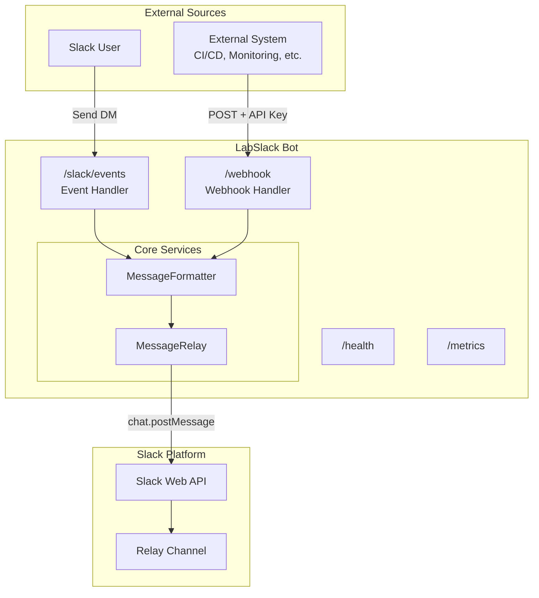
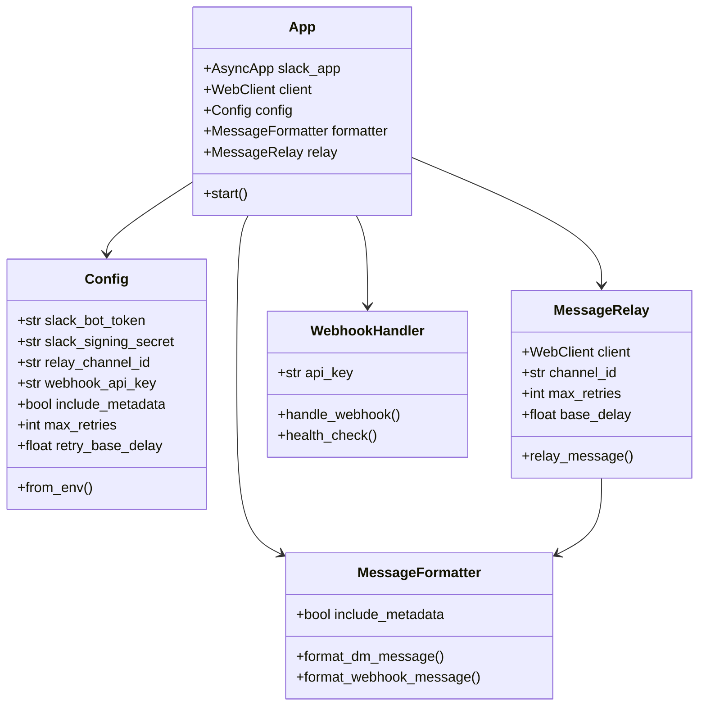
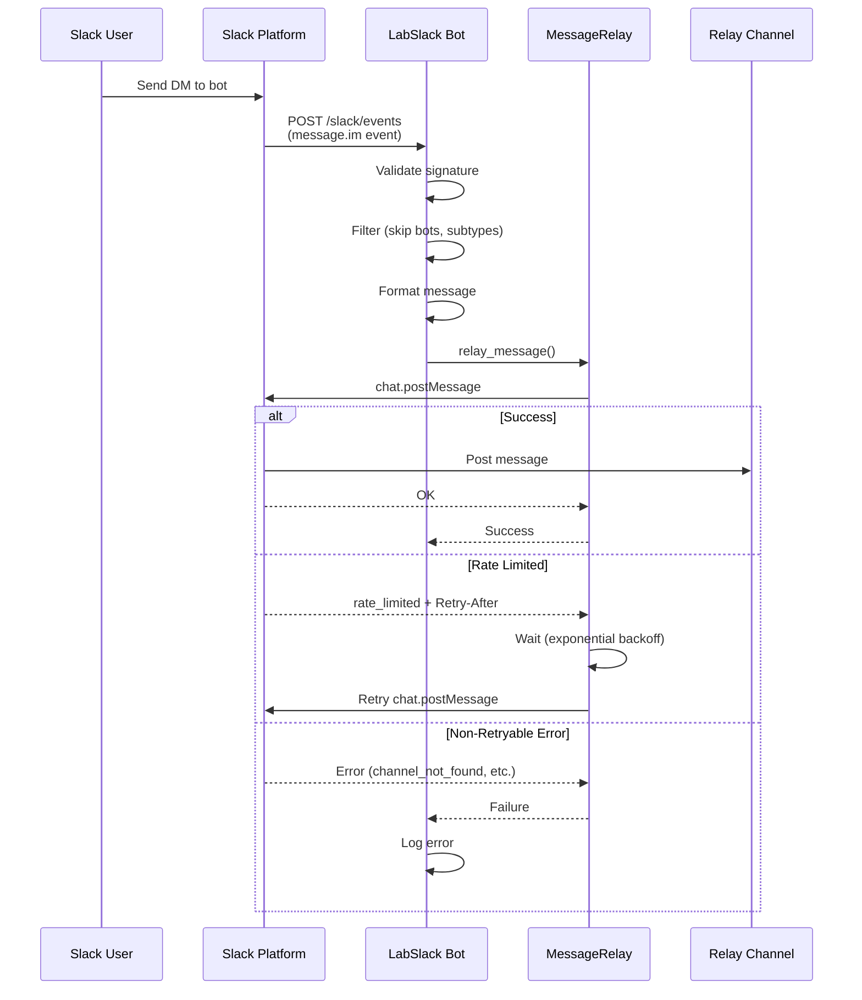
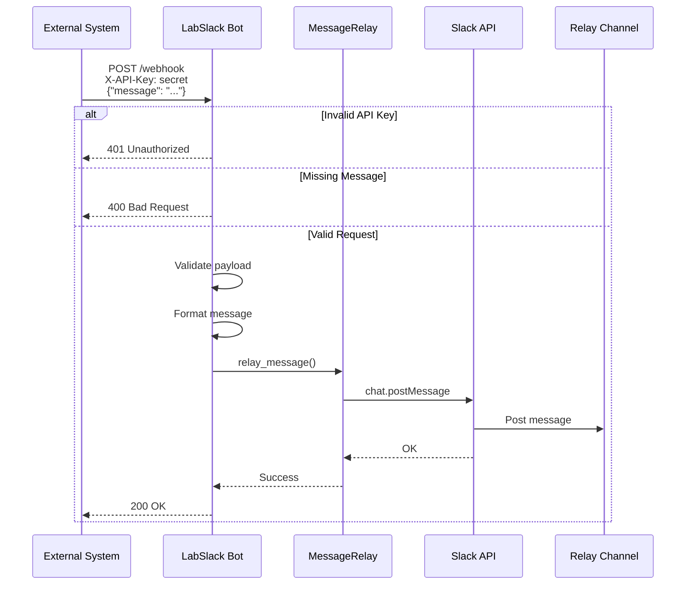
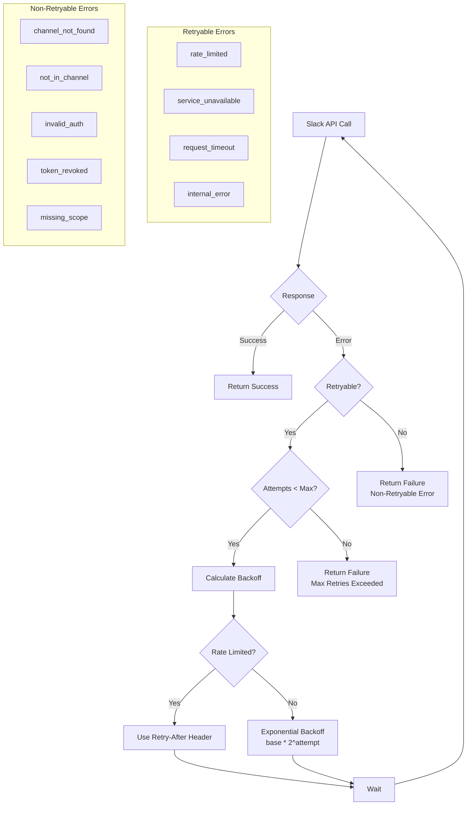
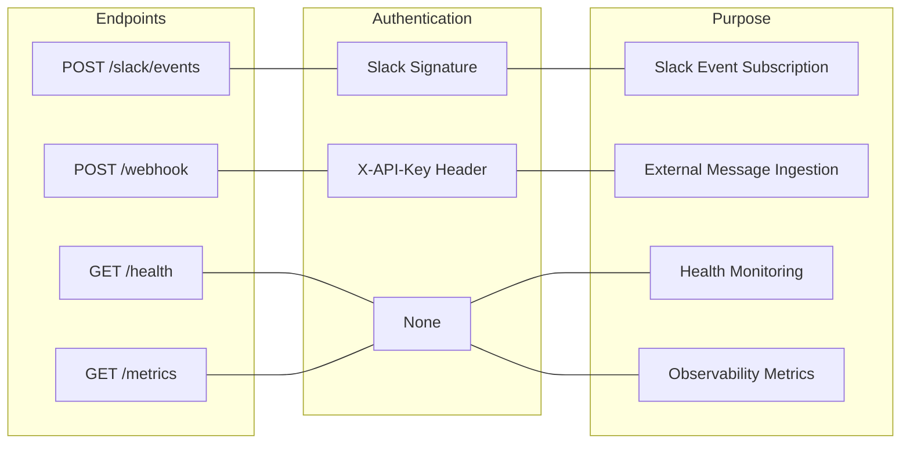
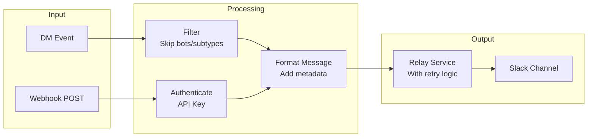
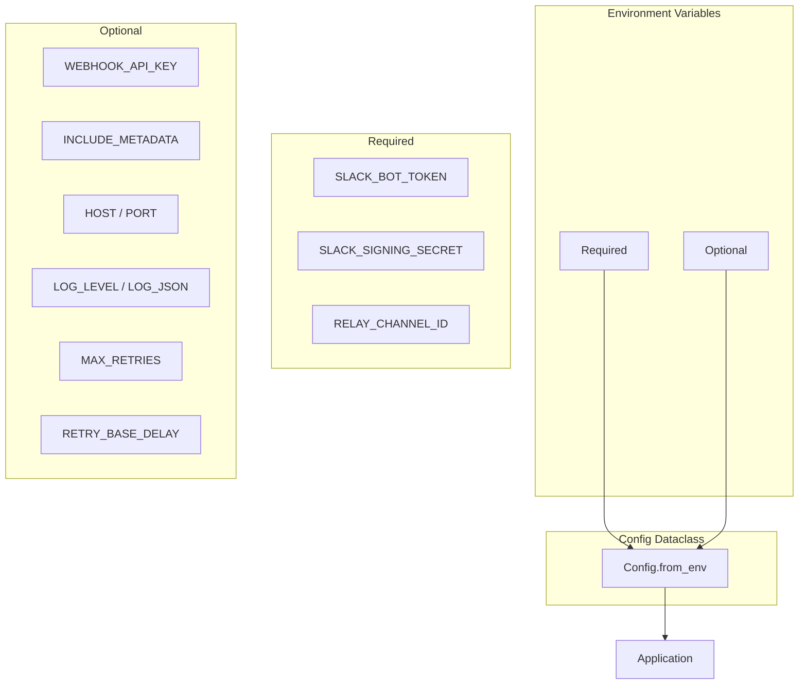
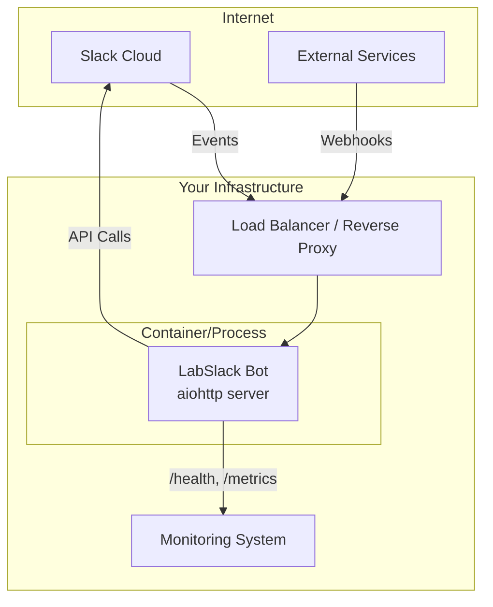

# LabSlack Architecture

This document describes the architecture of the LabSlack bot using Mermaid diagrams.

## System Overview

LabSlack is a Slack bot that relays messages from two sources to a designated Slack channel:
1. **Direct Messages (DMs)** sent to the bot
2. **External webhooks** from other systems

## Component Architecture

### Module Structure

## Message Flow

### DM Relay Flow

### Webhook Relay Flow

## Error Handling & Retry Logic

## API Endpoints

## Data Flow Overview

## Configuration

## Deployment Architecture

## Technology Stack

| Layer | Technology |
|-------|------------|
| Language | Python 3.12+ |
| Async Framework | asyncio |
| Slack SDK | slack-bolt (AsyncApp) |
| HTTP Server | aiohttp |
| Testing | pytest, pytest-bdd, pytest-asyncio |
| Linting | Ruff |
| Type Checking | mypy |
| Package Manager | uv |

---

*Diagrams rendered with [Mermaid](https://mermaid.js.org/). View in GitHub or any Mermaid-compatible viewer.*
